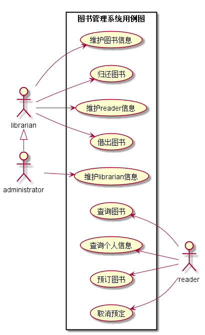
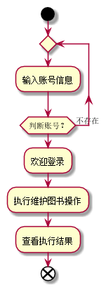
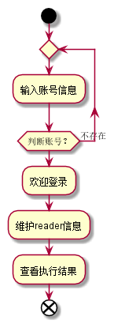
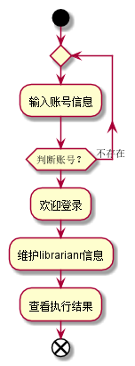
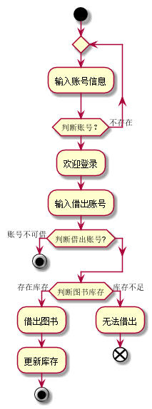
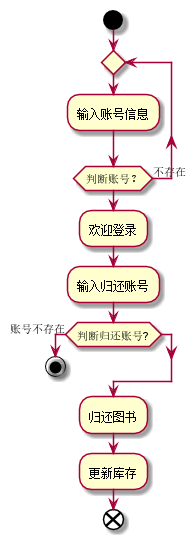
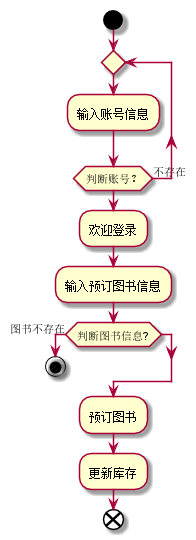
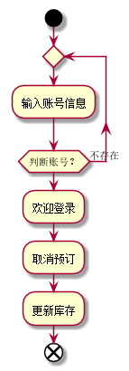
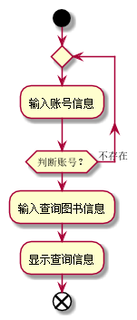
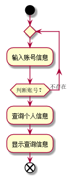

# 实验二：图书管理系统用例建模
|  学号  |  班级  |  姓名  |  照片  |
|:----    |:----    |:----   |:----   |
|  201510414230|软件（本）15-2|朱鹃|无|

### 1. 图书管理系统的用例关系图

##### 1.1 用例图PlantUML源码如下：

     @startuml
     left to right direction
     skinparam packageStyle rectangle
     :administrator:
     :librarian:
     :reader:
     rectangle  图书管理系统用例图{
     	librarian -> (维护图书信息)
     	librarian --> (借出图书)
     	librarian -> (归还图书)
     	librarian -> (维护reader信息)
     
     	administrator --> (维护librarian信息)
         (查询图书) <--reader
     	(查询个人信息) <--reader
     	(预订图书) <--reader
     	(取消预定) <--reader
     
     
     }
     librarian <|- administrator
     @enduml
  
 ##### 1.2. 用例图如下：

### 2. 参与者说明：

##### 2.1 administrator 超级管理员
主要职责是：管理一般的图书管理员的个人信息，与一般管理员是泛化关系，拥有管理员的全部行为。

##### 2.2 librarian 图书馆管理员
主要职责是：够维护图书的信息，读者能够在图书管理员处借阅和归还图书，能够对读者的信息进行维护。

##### 2.3 reader 读者
主要职责是：能够查阅图书，读者查询个人的信息，个人信息中有自己的借阅记录，能够预订图书和取消预订。

### 3. 用例规约表：
##### 3.1 维护图书信息
##### 3.1.1 用例流程图源码如下：
    @startuml
    start
    repeat
    :输入账号信息;
    repeat while(判断账号？) is (不存在)
       :欢迎登录;
       :执行维护图书操作;
       :查看执行结果;
    end
    @enduml 
##### 3.1.2 用例流程图如下：
 
##### 3.1.3 用例规约表如下：   
|用例名称|维护图书信息|
|:------:|:-------:|
|参与者|administrator、librarian|
|前置条件|administrator、librarian已被识别和授权|
|后置条件|保存更新图书信息|
|主事件流|1.输入账号 2.系统验证账户的身份 3.登录成功进入主页面 3.执行维护操作 |
|备选事件流|2a.系统提示账号信息有误，请重新进行输入 |
|备注|图书的维护不需要读者的参与|

##### 3.2 维护reader信息
##### 3.2.1 用例流程图源码如下：
    @startuml
    start
    repeat
    :输入账号信息;
    repeat while(判断账号？) is (不存在)
       :欢迎登录;
       :维护reader信息;
       :查看执行结果;
    end
    @enduml
##### 3.2.2 用例流程图如下：
 
##### 3.2.3 用例规约表如下：   
|用例名称|维护reader信息|
|:------:|:-------:|
|参与者|administrator、librarian|
|前置条件|administrator、librarian已被识别和授权|
|后置条件|保存更新reader信息|
|主事件流|1.输入账号 2.系统验证账户的身份 3.登录成功进入主页面 3.执行维护操作 |
|备选事件流|2a.系统提示账号信息有误，请重新进行输入 |
|备注|reader的信息是可以更改的|

##### 3.3 维护librarian信息
##### 3.3.1 用例流程图源码如下：
    @startuml
    start
    repeat
    :输入账号信息;
    repeat while(判断账号？) is (不存在)
       :欢迎登录;
       :维护librarianr信息;
       :查看执行结果;
    end
    @enduml
##### 3.3.2 用例流程图如下：
 
##### 3.3.3 用例规约表如下：   
|用例名称|维护librarian信息|
|:------:|:-------:|
|参与者|administrator|
|前置条件|administrator已被识别和授权|
|后置条件|保存更新librarian信息|
|主事件流|1.输入账号 2.系统验证账户的身份 3.登录成功进入主页面 3.执行维护操作 |
|备选事件流|2a.系统提示账号信息有误，请重新进行输入 |
|备注|这是最高权限所有者的操作|

##### 3.4 借出图书
##### 3.4.1 用例流程图源码如下：
       @startuml
       start
       repeat
       :输入账号信息;
       repeat while(判断账号？) is (不存在)
          :欢迎登录;
          :输入借出账号;
       if(判断借出账号?) then (账号不可借)
       stop
       endif
       if(判断图书库存) then (存在库存)
              :借出图书;
              :更新库存;
              stop
       else(库存不足)
                 :无法借出;
       end
       @enduml
##### 3.4.2 用例流程图如下：
 
##### 3.4.3 用例规约表如下：   
|用例名称|借出图书|
|:------:|:-------:|
|参与者|administrator、librarian|
|前置条件|administrator、librarian已被识别和授权|
|后置条件|更新图书信息|
|主事件流|1.输入账号 2.系统验证账户的身份 3.登录成功进入主页面 3.执行借出操作 4.更新图书库存 |
|备选事件流|2a.系统提示账号信息有误，请重新进行输入 3a.输入的reader账户有误，请重新输入 4a.库存不足，不能借阅|
|备注|图书馆开架借阅，读者找到书后在管理员处办理借阅手续|

##### 3.5 归还图书
##### 3.5.1 用例流程图源码如下：
       @startuml
              start
              repeat
              :输入账号信息;
              repeat while(判断账号？) is (不存在)
                 :欢迎登录;
                 :输入归还账号;
              if(判断归还账号?) then (账号不存在)
              stop
              endif
                     :归还图书;
                     :更新库存;
              end
        @enduml
##### 3.5.2 用例流程图如下：
 
##### 3.5.3 用例规约表如下：   
|用例名称|归还图书|
|:------:|:-------:|
|参与者|administrator、librarian|
|前置条件|administrator、librarian已被识别和授权|
|后置条件|更新图书信息|
|主事件流|1.输入账号 2.系统验证账户的身份 3.登录成功进入主页面 3.执行归还操作 4.更新图书库存 |
|备选事件流|2a.系统提示账号信息有误，请重新进行输入 3a.输入的reader账户有误，请重新输入 |
|备注|读者拿着书在管理员处办理归还手续|

##### 3.6 预订图书
##### 3.6.1 用例流程图源码如下：
      @startuml
             start
             repeat
             :输入账号信息;
             repeat while(判断账号？) is (不存在)
                :欢迎登录;
                :输入预订图书信息;
             if(判断图书信息?) then (图书不存在)
             stop
             endif
                    :预订图书;
                    :更新库存;
             end
       @enduml
##### 3.6.2 用例流程图如下：
 
##### 3.6.3 用例规约表如下：   
|用例名称|预订图书|
|:------:|:-------:|
|参与者|reader|
|前置条件|reader已被识别和授权|
|后置条件|更新图书信息|
|主事件流|1.输入账号 2.系统验证账户的身份 3.登录成功进入主页面 3.输入预订图书信息 4.更新图书库存 |
|备选事件流|2a.系统提示账号信息有误，请重新进行输入 3a.输入的图书信息不存在，请重新输入 |
|备注|在网上就可以操作|

##### 3.7 取消预订
##### 3.7.1 用例流程图源码如下：
      @startuml
             start
             repeat
             :输入账号信息;
             repeat while(判断账号？) is (不存在)
                :欢迎登录;
                :取消预订;
                :更新库存;
             end
       @enduml
##### 3.7.2 用例流程图如下：
 
##### 3.7.3 用例规约表如下：   
|用例名称|取消预订|
|:------:|:-------:|
|参与者|reader|
|前置条件|reader已被识别和授权|
|后置条件|更新图书信息|
|主事件流|1.输入账号 2.系统验证账户的身份 3.登录成功进入主页面 3.取消预订 4.更新图书库存 |
|备选事件流|2a.系统提示账号信息有误，请重新进行输入 |
|备注|网上就可以操作|

##### 3.8 查询图书
##### 3.8.1 用例流程图源码如下：
     @startuml
                    start
                    repeat
                    :输入账号信息;
                    repeat while(判断账号？) is (不存在)
                       :输入查询图书信息;
                       :显示查询信息;
                    end
      @enduml
##### 3.8.2 用例流程图如下：
 
##### 3.8.3 用例规约表如下：   
|用例名称|查询图书|
|:------:|:-------:|
|参与者|reader|
|前置条件|reader已被识别和授权|
|后置条件|显示查询信息|
|主事件流|1.输入账号 2.系统验证账户的身份 3.登录成功进入主页面 3.输入查询信息 |
|备选事件流|2a.系统提示账号信息有误，请重新进行输入 |
|备注|网上就可以操作|

##### 3.9 查询个人信息
##### 3.9.1 用例流程图源码如下：
     @startuml
                    start
                    repeat
                    :输入账号信息;
                    repeat while(判断账号？) is (不存在)
                       :查询个人信息;
                       :显示查询信息;
                    end
      @enduml
##### 3.9.2 用例流程图如下：
 
##### 3.9.3 用例规约表如下：   
|用例名称|查询个人信息|
|:------:|:-------:|
|参与者|reader|
|前置条件|reader已被识别和授权|
|后置条件||
|主事件流|1.输入账号 2.系统验证账户的身份 3.登录成功进入主页面 3.查询个人信息 |
|备选事件流|2a.系统提示账号信息有误，请重新进行输入 |
|备注|网上就可以操作|