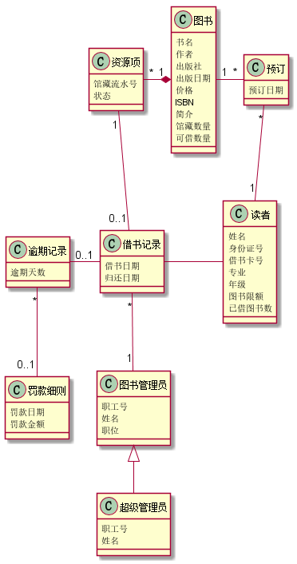

# 实验三：图书管理系统领域对象建模
|  学号  |  班级  |  姓名  |  照片  |
|:----    |:----    |:----   |:----   |
|  201510414230|软件（本）15-2|朱鹃|无|

### 1.  图书管理系统的类图

##### 1.1 类图PlantUML源码如下：

    @startuml
    class 图书{
        书名
        作者
        出版社
        出版日期
        价格
        ISBN
        简介
        馆藏数量
        可借数量
    }
    
    class 预订{
        预订日期
    }
    
    class 读者{
        姓名
        身份证号
        借书卡号
        专业
        年级
        图书限额
        已借图书数
    }
    
    class 借书记录{
        借书日期
        归还日期
    }
    
    class 资源项{
          馆藏流水号
          状态
    }
    class 图书管理员{
        职工号
        姓名
        职位
    }
    
    class 超级管理员{
         职工号
         姓名
    }
    class 逾期记录{
       逾期天数
    }
    
    class 罚款细则{
        罚款日期
        罚款金额
    }
    图书 "1"-right-"*" 预订
    预订 "*"-down-"1" 读者
    读者 -left- 借书记录
    借书记录 "0..1"-up-"1" 资源项
    资源项 "*"-left-*"1" 图书
    借书记录 "*"-down- "1" 图书管理员
    图书管理员 <|-down- 超级管理员
    借书记录 "1"-left-"0..1" 逾期记录
    逾期记录 "*"-down-"0..1" 罚款细则
    @enduml
  
 ##### 1.2. 类图如下：

#### 1.3. 类图说明：
该类图主要有图书类、预订类、读者类、借书记录类、逾期记录类、罚款细则类、图书管理员类、超级管理员类、资源项类。图书管理员与超级管理员存在泛化关系，超级管理员是一种类型的图书管理员；其他的关联关系如类图所示。

### 2. 图书管理系统的对象图

##### 2.1 类图书的对象图
#####  源码如下：
    @startuml
    object 图书{
        书名=JavaScript设计模式与开发实践
        作者=曽探
        出版社=人民邮电出版社
        出版日期=2015-05
        价格=59：00
        ISBN=978-7-115-38888-9
        简介=JavaScript设计模式
        馆藏数量=10
        可借数量=7
    }
    @enduml
##### 对象图如下：

##### 2.2 类预订的对象图
#####  源码如下：
    @startuml
    object 预订{
        预订日期=2018-04-03
    }
    @enduml
##### 对象图如下：

##### 2.3 类读者的对象图
#####  源码如下：
    @startuml
    object 读者{
            姓名=莉莉
            身份证号=511323199909245676
            借书卡号=201510423108
            专业=英语
            年级=2015
            图书限额=24
            已借图书数=6
    }
    @enduml
##### 对象图如下：

##### 2.4 类借书记录的对象图
#####  源码如下：
    @startuml
    object 借书记录{
              借书日期=2018-04-02
              归还日期=2018-04-17
          }
    @enduml
##### 对象图如下：

##### 2.5 类逾期记录的对象图
#####  源码如下：
    @startuml
           object 逾期记录{
                     逾期天数=0
                  }
    @enduml
##### 对象图如下：

##### 2.6 类罚款细则的对象图
#####  源码如下：
    @startuml
           object 罚款细则{
                      罚款日期=2018-06-11
                      罚款金额=0.10
                  }
    @enduml
##### 对象图如下：

##### 2.7 类资源项的对象图
#####  源码如下：
    @startuml
             object 资源项{
              馆藏流水号=201804001
              状态=借出
              }
    @enduml
##### 对象图如下：

##### 2.8 类图书管理员的对象图
#####  源码如下：
    @startuml
              object 图书管理员{
                  职工号=2015110
                  姓名=赵言
                  职位=室长
                   }
     @enduml
##### 对象图如下：

##### 2.9 类超级管理员的对象图
#####  源码如下：
    @startuml
             object 超级管理员{
                    职工号=2011311
                    姓名=王非
                }
    @enduml
##### 对象图如下：

