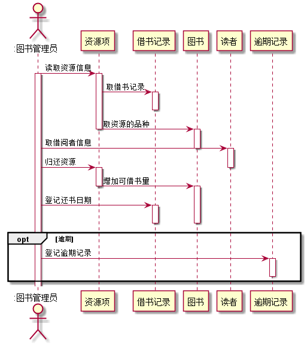
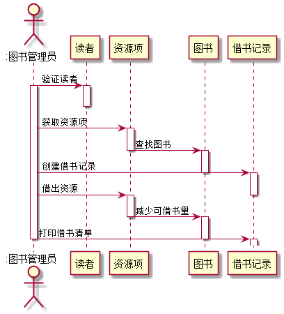
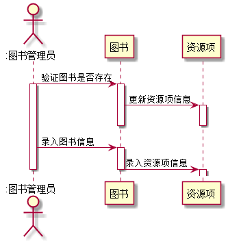
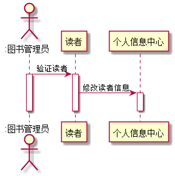
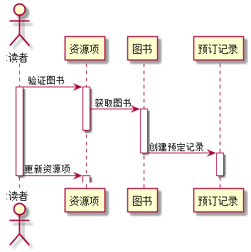
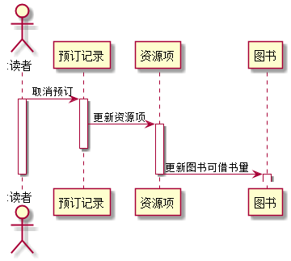

# 实验四：图书管理系统顺序图绘制
|  学号  |  班级  |  姓名  |  照片  |
|:----    |:----    |:----   |:----   |
|  201510414230|软件（本）15-2|朱鹃|无|
### 图书管理系统的顺序图

### 1.  还书用例顺序图

##### 1.1 还书用例PlantUML源码：

    @startuml
    actor ":图书管理员" as librarian
    participant "资源项"
    participant "借书记录"
    participant "图书"
    participant "读者"
    participant "逾期记录"
    librarian -> 资源项: 读取资源信息
    activate librarian
    activate 资源项
    资源项 -> 借书记录:取借书记录
    activate 借书记录
    deactivate 借书记录
    资源项 -> 图书:取资源的品种
    deactivate 资源项
    activate 图书
    librarian -> 读者:取借阅者信息
    deactivate 图书
    activate 读者
    librarian -> 资源项:归还资源
    deactivate 读者
    activate 资源项
    资源项 -> 图书:增加可借书量
    deactivate 资源项
    activate 图书
    librarian -> 借书记录:登记还书日期
    activate 借书记录
    deactivate 图书
    deactivate 借书记录
    opt 逾期
    librarian -> 逾期记录:登记逾期记录
    activate 逾期记录
    deactivate 逾期记录
    end
    @enduml
  
 ##### 1.2. 还书用例顺序图：

#### 1.3. 还书用例顺序图说明：
资源项是对图书状态的记录，图书管理员先根据资源项把图书的信息记录，再把借阅者信息录入，然后增加借书量，还书成功，若出现逾期，就登记逾期记录。

### 2. 借书用例顺序图

#####  2.1 借书用例PlantUML源码：
    @startuml
    actor ":图书管理员" as librarian
    participant "读者"
    participant "资源项"
    participant "图书"
    participant "借书记录"
    
    librarian -> 读者: 验证读者
    activate librarian
    activate 读者
    deactivate 读者
    librarian -> 资源项:获取资源项
    activate 资源项
    资源项 -> 图书:查找图书
    deactivate 资源项
    activate 图书
    librarian -> 借书记录:创建借书记录
    deactivate 图书
    activate 借书记录
    librarian -> 资源项:借出资源
    deactivate 借书记录
    activate 资源项
    资源项 -> 图书:减少可借书量
    deactivate 资源项
    activate 图书
    librarian -> 借书记录:打印借书清单
    deactivate 图书
    activate 借书记录
    deactivate librarian
    deactivate 借书记录
    @enduml
##### 2，2借书用例顺序图

##### 2.3借书用例顺序图说明
图书管理员先验证借阅者，然后获取所借图书的资源项，查找图书，创建借阅者的借书记录，把所借图书的可借书量减少，打印借书清单。

#### 3 维护图书用例顺序图
#####  3.1 维护图书用例PlantUML源码：
       @startuml
       actor ":图书管理员" as librarian
       participant "图书"
       participant "资源项"
       
       librarian -> 图书: 验证图书是否存在
       activate librarian
       activate 图书
       图书 -> 资源项: 更新资源项信息
       activate 资源项
       deactivate 图书
       deactivate 资源项
       librarian -> 图书: 录入图书信息
       activate 图书
       图书 -> 资源项:录入资源项信息
       deactivate 图书
       activate 资源项
       deactivate librarian
       @enduml
##### 3.2 维护图书用例顺序图

 
 ##### 3.3 维护图书用例顺序图说明
 图书管理员在录入图书时，验证图书在馆藏中是否存在，存在就更新图书的资源项信息，不存在，就录入图书信息，创建资源项信息。

#### 4 维护读者用例的顺序图
#####  4.1维护读者顺序图源码如下：
    @startuml
    actor ":图书管理员" as librarian
    participant "读者"
    participant "个人信息中心"
    
    librarian -> 读者: 验证读者
    activate librarian
    activate 读者
    读者 -> 个人信息中心: 修改读者信息
    activate 个人信息中心
    deactivate 读者
    deactivate 个人信息中心
    deactivate librarian
    @enduml
##### 4.2维护读者顺序图：

##### 4.3维护读者顺序图说明
管理员验证读者的信息，成功后进行读者信息修改。

#### 5 预订图书用例的顺序图
#####  5.1预订图书顺序图源码如下：
    @startuml
           actor ":读者" as reader
           participant "资源项"
           participant "图书"
           participant "预订记录"
           reader -> 资源项: 验证图书
           activate reader
           activate 资源项
           资源项 -> 图书: 获取图书
           activate 图书
           deactivate 资源项
           图书 -> 预订记录: 创建预定记录
           deactivate 图书
           activate 预订记录
           reader -> 资源项: 更新资源项
           deactivate 预订记录
           activate 资源项
           deactivate reader
           @enduml
##### 5.2预订图书用例顺序图：

##### 5.3预订图书用例顺序图说明
 系统验证读者，读者输入资源项信息，查找图书，找到后预订创建预订记录，更新资源项信息。

#### 6 取消预订用例的顺序图
#####  6.1取消预订用例的顺序图源码如下：
       @startuml
              actor ":读者" as reader
              participant "预订记录"
               participant "资源项"
               participant "图书"
              reader -> 预订记录: 取消预订
              activate reader
              activate 预订记录
              预订记录 -> 资源项: 更新资源项
              activate 资源项
              deactivate 预订记录
              资源项 -> 图书: 更新图书可借书量
              deactivate 资源项
              activate 图书
              deactivate reader
              @enduml
##### 6.2 取消预订用例的顺序图

##### 6.3 取消预订用例的顺序图说明
读者登录账号，找到自己的预定记录，点击取消预定，更新资源项信息，更新图书的可借书量。

