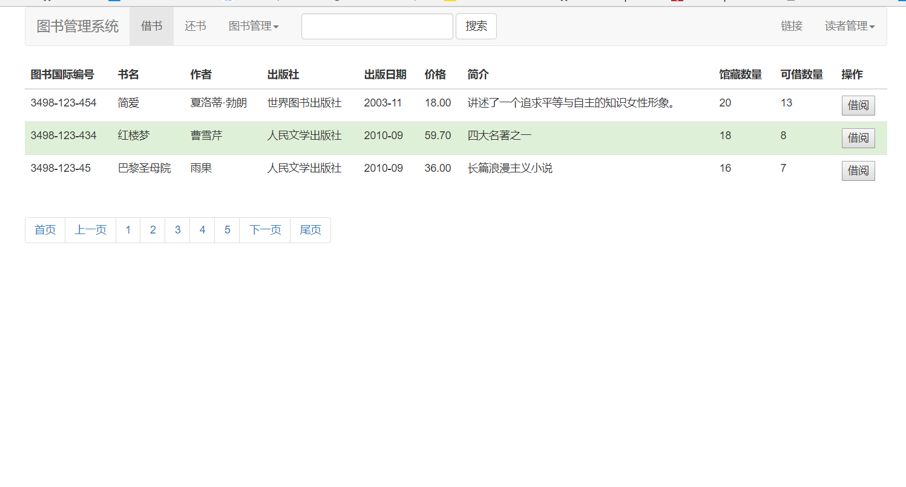

# 实验5：图书管理系统数据库设计与界面设计
|  学号  |  班级  |  姓名  |  照片  |
|:----    |:----    |:----   |:----   |
|  201510414230|软件（本）15-2|朱鹃|无|

### 1 数据库表设计

##### 1.1 图书表

|  字段  |  类型  |  主键 外键  |  可以为空  |   默认值  |  约束  |   说明  |
|:-----:|:----:|:-----:|:----:|:-----:|:-----:|:----:|
|  ISBN  |  varchar（100）  |  主键  |  否  |     |    |  图书国际编码   |
| bookName   |  varchar(100)  |   |  否  |     |    |  书名   |
| author   |  varchar(100)  |   |  可以为空  |     |    |   作者  |
|  publisher  |  varchar(100)  |    |  可以为空  |     |    |  出版社   |
|  publishTime  |  datetime  |    |  可以为空  | getdate() |    |   出版日期  |
|price    |  float  |    |  可以为空  |     |    | 价格    |
|  discription  |  varchar(100)  |    |  可以为空  |     |    | 简介    |
|  cnum  |  int(15)  |    |  可以为空  |     |    |    馆藏数量 |
|  lnum  |  int(15)  |    |  可以为空  |     |    | 可借数量    |

##### 1.2 读者表

|  字段  |  类型  |  主键 外键  |  可以为空  |   默认值  |  约束  |   说明  |
|:-----:|:----:|:-----:|:----:|:-----:|:-----:|:----:|
|  name  |  varchar（100）  |    |  否  |     |    |  图书国际编码   |
| Idcard   |  varchar(50)  |   |  否  |     |    |  身份证号   |
| readerId   |  varchar(100)  |  主键 |  可以为空  |     |    |   借书卡号  |
|  major  |  varchar(60)  |    |  可以为空  |     |    |  专业   |
|  grade  |  datetime  |    |  可以为空  |  |    |   年级  |
|quoto|  float  |    |  可以为空  |     |    | 图书限额    |
|  lendnum  |  varchar(100)  |    |  可以为空  |     |    | 已借图书数    |

##### 1.3 超级管理员表

|  字段  |  类型  |  主键 外键  |  可以为空  |   默认值  |  约束  |   说明  |
|:-----:|:----:|:-----:|:----:|:-----:|:-----:|:----:|
|  employeeNumber  |  varchar（100）  |  主键  |  否  |     |    |  职工号   |
| name   |  varchar(50)  |   | 可以为空   |     |    |  姓名   |
| password   |  varchar(50)  |   | 否   |     |    |  密码，采用加密处理   |

##### 1.4 管理员表

|  字段  |  类型  |  主键 外键  |  可以为空  |   默认值  |  约束  |   说明  |
|:-----:|:----:|:-----:|:----:|:-----:|:-----:|:----:|
|  employeeNumber  |  varchar（100）  |  主键  |  否  |     |    |  职工号   |
| name   |  varchar(50)  |   | 可以为空   |     |    |  姓名   |
| password   |  varchar(50)  |   | 否   |     |    |  密码，采用加密处理   |
| position   |  varchar(100)  |   |  可以为空  |     |    |   职位  |

##### 1.5 借书表

|  字段  |  类型  |  主键 外键  |  可以为空  |   默认值  |  约束  |   说明  |
|:-----:|:----:|:-----:|:----:|:-----:|:-----:|:----:|
|  readerId  |  varchar（100）  |  外键  |  否  |     |    |  借书卡号   |
| ISBN   |  varchar(100)  | 外键  |  否  |     |    |  图书国际编码   |
| id   |  varchar(50)  | 主键  |  否  |     |    |     |
| dateofborrow   |  datetime  |   |  否  |     |    |   借书日期  |
| dateofreturn   |  datetime  |   |  否  |     |    |   借书日期  |

##### 1.6 资源项表

|  字段  |  类型  |  主键 外键  |  可以为空  |   默认值  |  约束  |   说明  |
|:-----:|:----:|:-----:|:----:|:-----:|:-----:|:----:|
| ISBN   |  varchar(100)  | 外键  | 否   |     |    |  图书国际编码   |
| id   |  varchar(50)  | 主键  |  否  |     |    |   馆藏流水号  |
| status   |  varchar(100)  |   |  否  |     |    |  状态   |

##### 1.7 预订表

|  字段  |  类型  |  主键 外键  |  可以为空  |   默认值  |  约束  |   说明  |
|:-----:|:----:|:-----:|:----:|:-----:|:-----:|:----:|
| ISBN   |  varchar(100)  | 外键  | 否   |     |    |  图书国际编码   |
| id   |  varchar(50)  | 主键  |  否  |     |    |   馆藏流水号  |
| readerId   |  varchar(100)  | 外键  |  否  |     |    |  借书证号   |
| booktime   |  datetime  |  |  否  |     |    |  预订日期   |

##### 1.8 罚款细则表

|  字段  |  类型  |  主键 外键  |  可以为空  |   默认值  |  约束  |   说明  |
|:-----:|:----:|:-----:|:----:|:-----:|:-----:|:----:|
| id   |  varchar(50)  | 主键  |  否  |     |    |     |
| readerId   |  varchar(100)  | 外键  |  否  |     |    |  借书证号   |
| finetime   |  datetime  |  |  否  |     |    |  罚款日期   |
| finemoney   |  float  |  |    |     |    |  罚款金额   |
| finediscription   |  varchar(100)  |  |    |     |    |  罚款细则   |

### 2 界面设计

##### 2.1 借书界面设计

*  用例图参见：借书用例
* 类图参见：借书类，读者类
* 顺序图参见：借书顺序图
* API接口如下：
1. 查询API
* 功能：根据输入信息，查询图书信息
* 请求地址：http://localhost:8080/library/search/list
* 请求方法：GET
* 请求参数：

| 参数名称 | 必填  | 说明  |
|:------:|:-----:|:-----:|
|  ISBN  |  是  |根据图书的ISBN编码查询图书  |

* 返回实例：
   
 ```
 {
        "code": 200,
        "data": {
            "ISBN": "3498-123-454",
            "bookName": "简爱",
            "author": "夏洛蒂·勃朗",
            "publisher": "世界图书出版社",
            "publishTime": 2003-11,
            "price": 18.00,
            "discription": "讲述了一个追求平等与自主的知识女性形象",
            "cnum": "20",
            "lnum":13,
         },
        "msg": "操作成功"
}
```
* 返回参数说明

| 参数名称 | 说明  |
|:------:|:-----:|
|  code  | 请求响应状态  |
|  data  | 图书的信息  |
|  msg  | 返回信息  |


2.修改图书API
* 功能：点击借阅，图书的可借数量减一
* 请求地址：http://localhost:8080/library/update/booknum
* 请求方法：POST
* 请求参数：

| 参数名称 | 必填  | 说明  |
|:------:|:-----:|:-----:|
|  lnum  |  是  |可借数量减1  |

* 返回实例：

```
{
        "code": 200,
        "data": {
            "ISBN": "3498-123-454",
            "bookName": "简爱",
            "author": "夏洛蒂·勃朗",
            "publisher": "世界图书出版社",
            "publishTime": 2003-11,
            "price": 18.00,
            "discription": "讲述了一个追求平等与自主的知识女性形象",
            "cnum": "20",
            "lnum":12,
         },
        "msg": "操作成功"
}   
```    
* 返回参数说明

| 参数名称 | 说明  |
|:------:|:-----:|
|  code  | 请求响应状态  |
|  data  | 图书的信息  |
|  msg  | 返回信息  |
