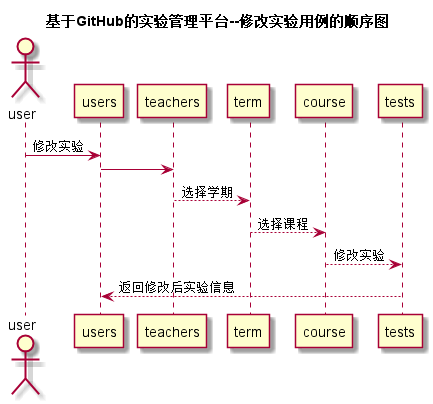

# “修改实验”用例 [返回](../README.md)
## 1. 用例规约

|用例名称|修改实验|
|-------|:-------------|
|功能|修改实验|
|参与者|老师|
|前置条件|必须先登录|
|后置条件| 实验内容改变|
|主事件流|1.用户输入网址 2.用户输入登录信息 3.用户点击实验管理 4.用户点击修改实验|
|备选事件流|无 |
## 2. 业务流程  [源码](../src/修改实验.puml)

## 3. 界面设计

* API接口调用
    * 接口1：[updateTest](../接口/updateTest.md)
    
## 4. 算法描述
无
    
## 5. 参照表
* [STUDENTS](../数据库设计.md/#STUDENTS)
* [TEACHERS](../数据库设计.md/#TEACHERS)
* [USERS](../数据库设计.md/#USERS)
* [TERM](../数据库设计.md/#TERM)
* [COURSE](../数据库设计.md/#COURSE)
* [TESTS](../数据库设计.md/#TESTS)
