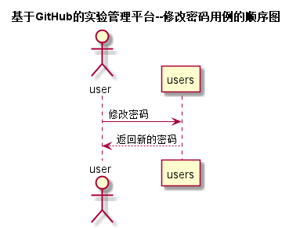

# “修改密码”用例 [返回](../README.md)
## 1. 用例规约

|用例名称|修改密码|
|-------|:-------------|
|功能|修改用户的密码|
|参与者|学生，老师|
|前置条件|必须先登录|
|后置条件|重置用户的密码 |
|主事件流|1.用户输入网址 2.用户输入登录信息 3.用户点击用户管理 4.用户点击修改密码|
|备选事件流|2.1student登录 2.2.teacher登录 |
|备注|无 |

## 2. 业务流程 [源码](../src/修改密码.puml)

## 3. 界面设计

* API接口调用
    * 接口1：[changePassword](../接口/changePassword.md)

## 4. 算法描述
无
    
## 5. 参照表
* [STUDENTS](../数据库设计.md/#STUDENTS)
* [TEACHERS](../数据库设计.md/#TEACHERS)
* [USERS](../数据库设计.md/#USERS)
