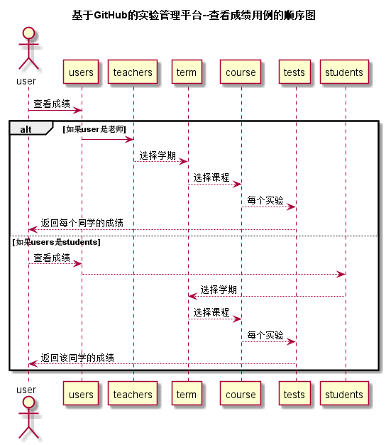

# “查看成绩”用例 [返回](../README.md)
## 1. 用例规约

|用例名称|查看成绩|
|-------|:-------------|
|功能|查看每个实验的成绩|
|参与者|学生，老师|
|前置条件|必须先登录|
|后置条件|无 |
|主事件流|1.用户输入网址 2.用户输入登录信息 3.用户点击成绩 4.用户点击查成绩 |
|备选事件流|2.1student登录 2.2.teacher登录 |
|备注|无 |

## 2. 业务流程 [源码](../src/查看成绩.puml)

## 3. 界面设计

* API接口调用
    * 接口1：[showScoreT](../接口/showScoreT.md)
    * 接口2：[showScoreS](../接口/showScoreS.md)

## 4. 算法描述
无
    
## 5. 参照表
* [STUDENTS](../数据库设计.md/#STUDENTS)
* [TEACHERS](../数据库设计.md/#TEACHERS)
* [USERS](../数据库设计.md/#USERS)
* [TERM](../数据库设计.md/#TERM)
* [COURSE](../数据库设计.md/#COURSE)
* [TESTS](../数据库设计.md/#TESTS)