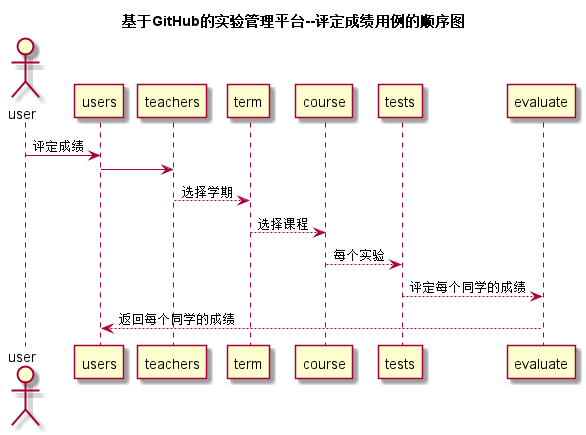

# “评定成绩”用例 [返回](../README.md)
## 1. 用例规约

|用例名称|评定成绩|
|-------|:-------------|
|功能|评定成绩|
|参与者|老师|
|前置条件|必须先登录|
|后置条件|每个学生的实验出现评分|
|主事件流|1.老师输入网址 2.老师输入登录信息 3.老师点击成绩 4.老师点击评定成绩 |
|备选事件流|无|
|备注|无 |

## 2. 业务流程 [源码](../src/评定成绩.puml)

## 3. 界面设计

* API接口调用
    * 接口1：[addGrades](../接口/addGrades.md)
  

## 4. 算法描述
无
    
## 5. 参照表
* [STUDENTS](../数据库设计.md/#STUDENTS)
* [TEACHERS](../数据库设计.md/#TEACHERS)
* [USERS](../数据库设计.md/#USERS)
* [TERM](../数据库设计.md/#TERM)
* [COURSE](../数据库设计.md/#COURSE)
* [TESTS](../数据库设计.md/#TESTS)
* [EVALUATE](../数据库设计.md/#EVALUATE)