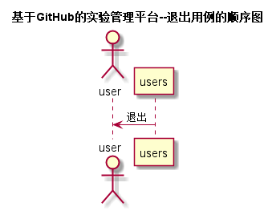

# “退出”用例 [返回](../README.md)
## 1. 用例规约

|用例名称|退出|
|-------|:-------------|
|功能|用户退出|
|参与者|学生，老师|
|前置条件|该用户已登录|
|后置条件|无 |
|主事件流|1用户点击退出|
|备选事件流|无|
|备注|无 |

## 2. 业务流程 [源码](../src/退出.puml)

## 3. 界面设计

* API接口调用
   无
    

## 4. 算法描述
无
    
## 5. 参照表
* [STUDENTS](../数据库设计.md/#STUDENTS)
* [TEACHERS](../数据库设计.md/#TEACHERS)
* [USERS](../数据库设计.md/#USERS)