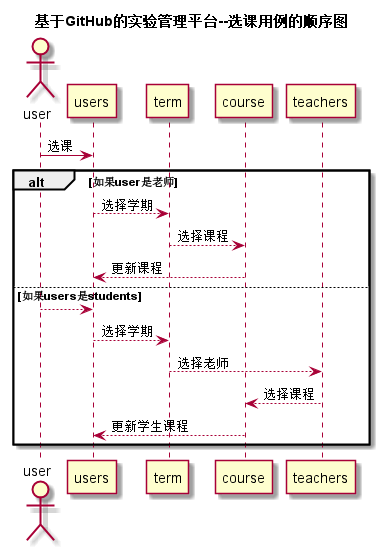

# “选课”用例 [返回](../README.md)
## 1. 用例规约

|用例名称|选课|
|-------|:-------------|
|功能|用户选择要学习的课程|
|参与者|学生，老师|
|前置条件|必须先登录|
|后置条件| |
|主事件流|1.用户输入网址 2.用户输入登录信息 3.用户点击课程 4.用户点击选课 |
|备选事件流|2.1student登录 2.2.teacher登录 |
## 2. 业务流程  [源码](../src/选课.puml)

## 3. 界面设计
* 界面参照: 顶部菜单.html
* API接口调用
    * 接口1：[addCourseT](../接口/addCourseT.md)
    * 接口2：[addCourseS](../接口/addCourseS.md)
## 4. 算法描述
无
    
## 5. 参照表
* [STUDENTS](../数据库设计.md/#STUDENTS)
* [TEACHERS](../数据库设计.md/#TEACHERS)
* [USERS](../数据库设计.md/#USERS)
* [TERM](../数据库设计.md/#TERM)
* [COURSE](../数据库设计.md/#COURSE)
